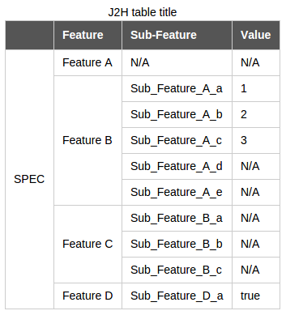

# JSON/Lua table to HTML table

## Feature
- **Works with `rowspan`**
- Convert JSON data(with extended markup declaration) to HTML table
- Library lua2html.lua for Lua table conversion
- Pad empty cell automatically. Keep the table always in regular
- Quickly generate a table with css from CLI. Good for my spec document writing

## Example

**Input:**

```json

TITLE=J3H table title
TH=;Feature;Sub-Feature;Value;

{
  "SPEC": [
    {
      "Feature A": []
    },
    {
      "Feature B": [
        {
          "Sub_Feature_A_a": 1
        },
        {
          "Sub_Feature_A_b": 2
        },
        {
          "Sub_Feature_A_c": 3
        },
        {
          "Sub_Feature_A_d": null
        },
        {
          "Sub_Feature_A_e": null
        }
      ]
    },
    {
      "Feature C": [
        "Sub_Feature_B_a",
        "Sub_Feature_B_b",
        "Sub_Feature_B_c"
      ]
    },
    {
      "Feature D": [
        {
          "Sub_Feature_D_a" : true
        }
      ]
    }
  ]
}

```

**Output:**



*The file is `test/spec.json.html`*

## How to use
- Compile [nixio.so](https://github.com/hh123okbb/nixio) and [Lua](https://github.com/hh123okbb/lua).

- CLI interface

	```
	Usage: ./json2html.sh [-c CSS_FILE] [-H] [-P] <JSON_FILE>

	Options:
		-c     css for table
		-H     don't output other HTML elements, just output HTML table elements
		-P     don't run pp.awk for pretty print (this script will use rowspan
			   to merge the same type of <td> elements), so that you can use
			   your own script to decorate the table or just import it to excel
	```

- JSON file syntax
	* `TITLE=`: Give the table a caption
	* `TH=;`: Declare the table headers. Each entry must ends with a `;`

- Lua library: Load lua2html.lua and include the libraries in `lib`. *Maybe you should setup your lua environment. Refer to `json2html.sh`*

## TODO
- Strip `nixio` dependencies

## Thanks
Lua common libraries (located in `lib/`) are stolen from [LuCI](http://luci.subsignal.org/) project.
