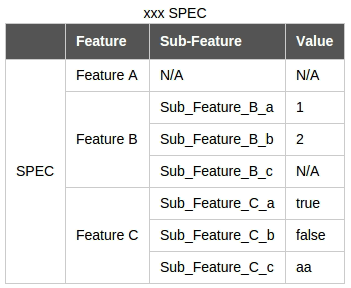
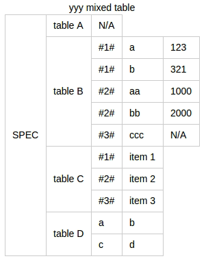

# JSON/Lua table to HTML table

## Feature
- **Works with `rowspan`**
- Convert JSON data(with extended markup declaration) to HTML table
- Library lua2html.lua for Lua table conversion
- Support to pad empty cell automatically. Keep the table always pretty
- Support to hide column of array's index
- Quickly generate a table with css from CLI. Good for my spec document writing

## Case 1
A default mode

**Input:**

`example/spec.json`:

```json
TITLE=xxx SPEC
TH=;Feature;Sub-Feature;Value;

{
  "SPEC": [
    {
      "Feature A": []
    },
    {
      "Feature B": [
        {
          "Sub_Feature_B_a": 1
        },
        {
          "Sub_Feature_B_b": 2
        },
        {
          "Sub_Feature_B_c": null
        }
      ]
    },
    {
      "Feature C": [
        {
          "Sub_Feature_C_a" : true,
          "Sub_Feature_C_b" : false
        },
        {
          "Sub_Feature_C_c" : "aa"
        }
      ]
    }
  ]
}
```

**Run json2html**

```sh
json2html example/spec.json > example/spec.html
```

**Output:**



*Screenshot for `example/spec.html`*

## Case 2
JSON with mixed tables

**Input:**

`example/spec2.json`:

```json
TITLE=yyy mixed tables

{
  "SPEC": {
    "table A": [],
    "table B": [
      {
        "a": 123,
        "b": 321
      },
      {
        "aa": 1000,
        "bb": 2000
      },
      {
        "ccc": null
      }
    ],
    "table C": [
      "item 1",
      "item 2",
      "item 3"
    ],
    "table D": {
      "a": "b",
      "c": "d"
    }
  }
}
```

**Run json2html**

```sh
json2html -C -R example/spec2.json > example/spec2.html
```

**Output:**



*Screenshot for `example/spec2.html`*

## Case 3
Export the html table to excel

1. run ``json2html -P <your_json_file> > <your_html_file>``
2. Open `<your_html_file>` in browser and just copy them to your excel
3. Merge the rows manually :(

## How to use
- CLI interface

	```
	Usage: json2html [-HCRP] [-c CSS_FILE] <JSON_FILE>

	Options:
		-c     CSS for table
		-H     Don't output other HTML elements, just output HTML table elements
		-C     Don't keep the table in concise. Means that pp.awk will never
			   hide any column which is stand for array index
		-R     Don't keep the table regular. Means no padding cell - "N/A"
		-P     Don't run pp.awk for pretty print (this script will use rowspan
			   to merge the same type of <td> elements), so that you can use
			   your own script to decorate the table or just export it to excel.
			   NOTE: In this mode, "-C" and "-R" is also enabled
	```

- Lua library: Include the libraries in `lib/`.

- JSON file syntax
	* `TITLE=`: Give the table a caption
	* `TH=;`: Declare the table headers. Each entry must ends with a `;`

## TODO
Now the json parser can't handle utf8 character

## Thanks
Lua common libraries (located in `lib/luci`) are stolen from [LuCI](http://luci.subsignal.org/) project.
